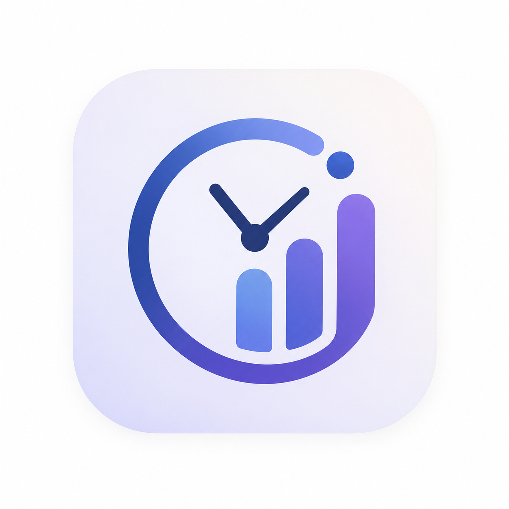
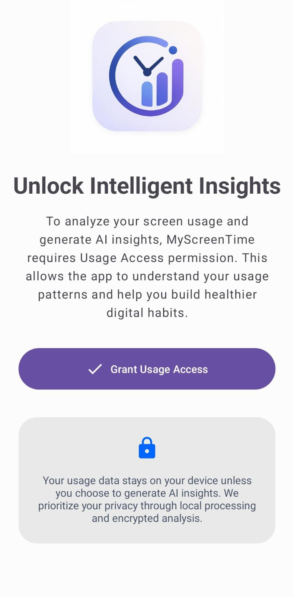
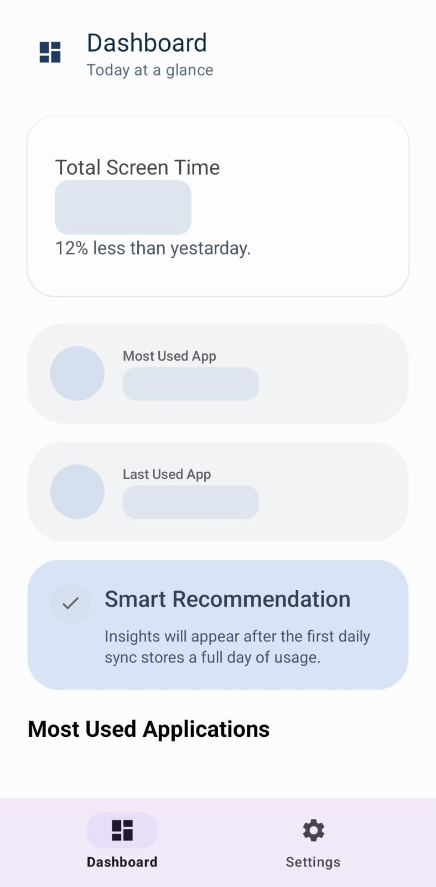
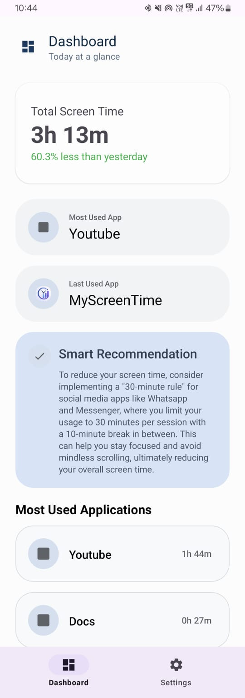
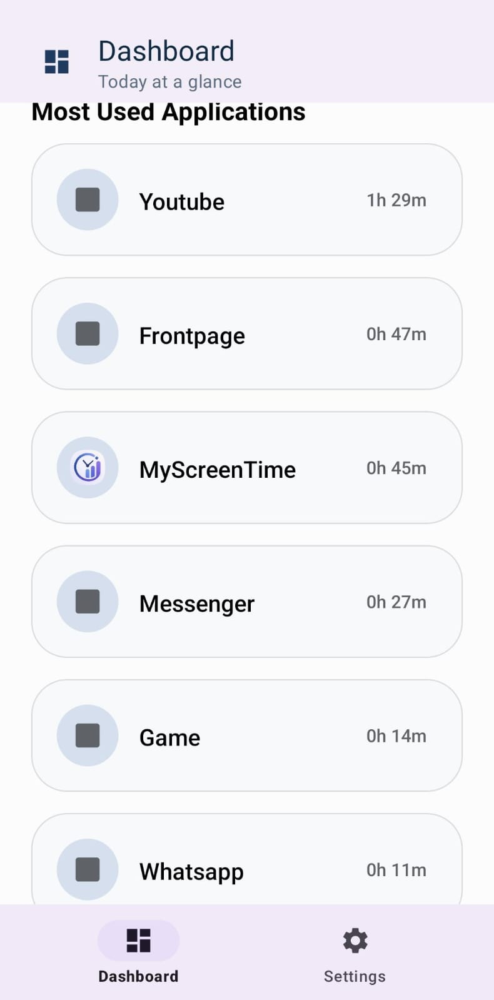
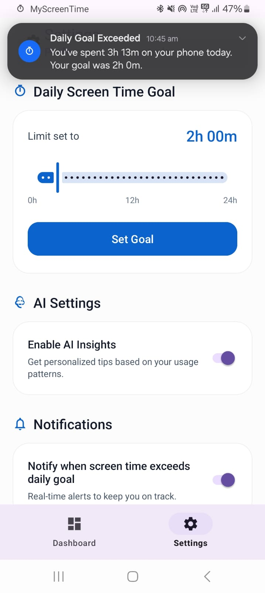

# MyScreenTime App

<p align="center">
  
</p>


An Android app for tracking screen time and app usage, with AI-generated insights on digital habits. Built on Android's `UsageStatsManager`, storing history locally in Room, with Gemini used to turn raw usage stats into readable feedback.

Status: early stage. This repo currently has the initial setup and this README, no screens or database code yet. Structure and plans below are subject to change as the project takes shape.

## Screenshots

<p align="center">
  <kbd></kbd>
  <kbd></kbd>
  <kbd></kbd>
</p>
<p align="center">
  <kbd></kbd>
  <kbd></kbd>
</p>

## Why

Most screen time apps just show you a pie chart and leave it there. The idea here is to go one step further: take the raw usage data and have an LLM summarize it into something actually useful, "you've been on Instagram 40% more this week than last," that kind of thing, plus let users set limits and get notified when they're blown past.

## Planned tech stack

- Kotlin, XML views, MVVM
- Room for local storage of usage history
- Retrofit + Gemini API for generating insights
- WorkManager for background checks against usage limits (undecided yet)

## Planned features

- Daily and per-app screen time tracking via `UsageStatsManager`
- Local history stored in Room
- AI-generated summaries of usage patterns
- Configurable daily limits with notifications when exceeded
- Weekly/monthly reports, data export (later, not near-term)

## Permissions

Will require Usage Access permission (`PACKAGE_USAGE_STATS`) to read app usage stats. Nothing gets sent off-device without the user triggering it.

## Setup

Requires Android Studio, SDK 24+, JDK 17.

```bash
git clone https://github.com/YashBhadange2006/MyScreenTime.git
```

Open in Android Studio, let Gradle sync, run on a device or emulator.

## Contributing

Open to it once there's actual code to contribute to. For now, issues/suggestions are fine.

## License

MIT, see `LICENSE`.

## Author

Yash Bhadange
[GitHub](https://github.com/YashBhadange2006) · [LinkedIn](https://www.linkedin.com/in/yash-bhadange-41b713308/)
