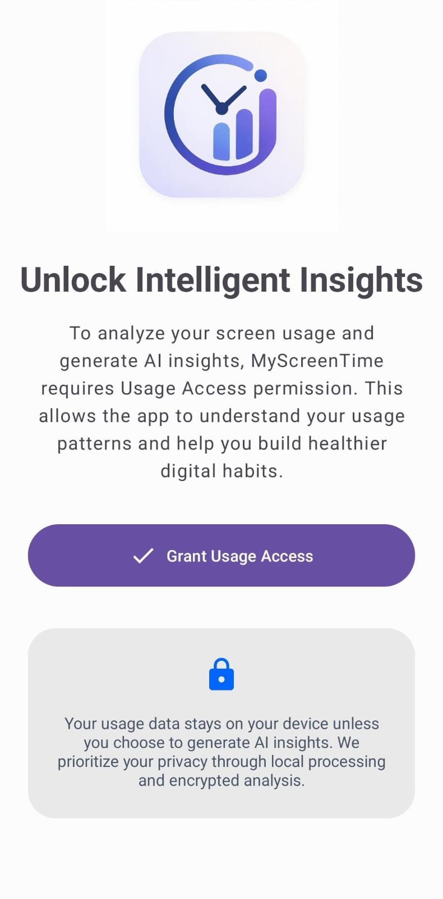
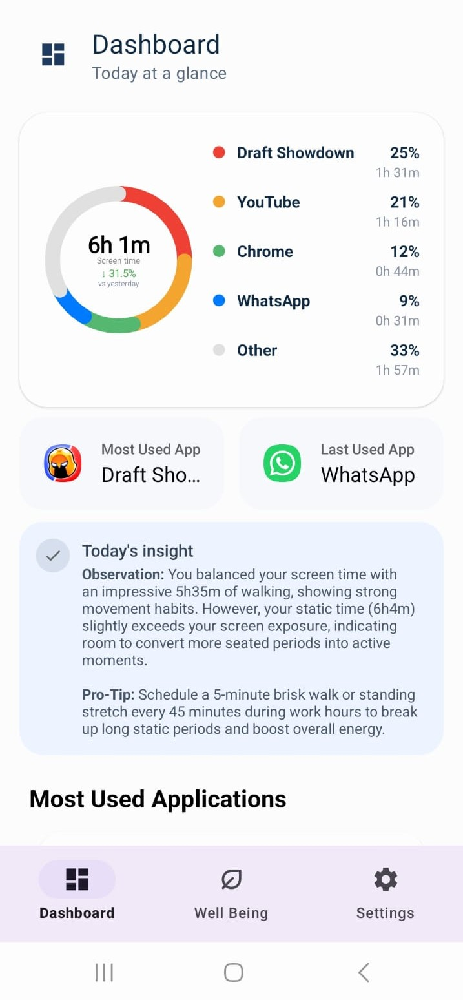
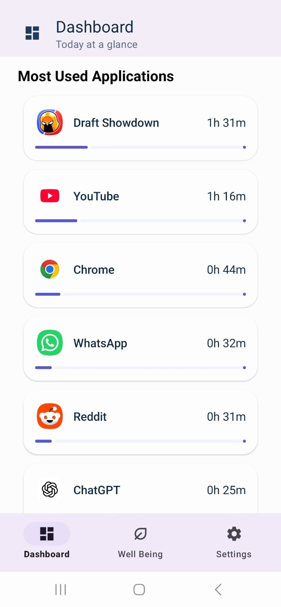
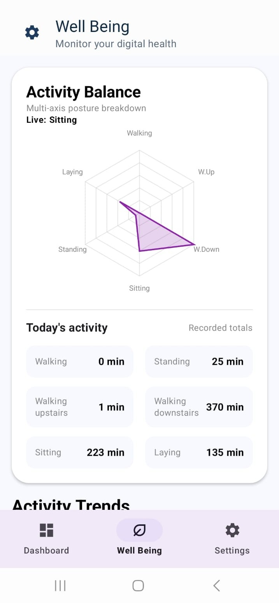
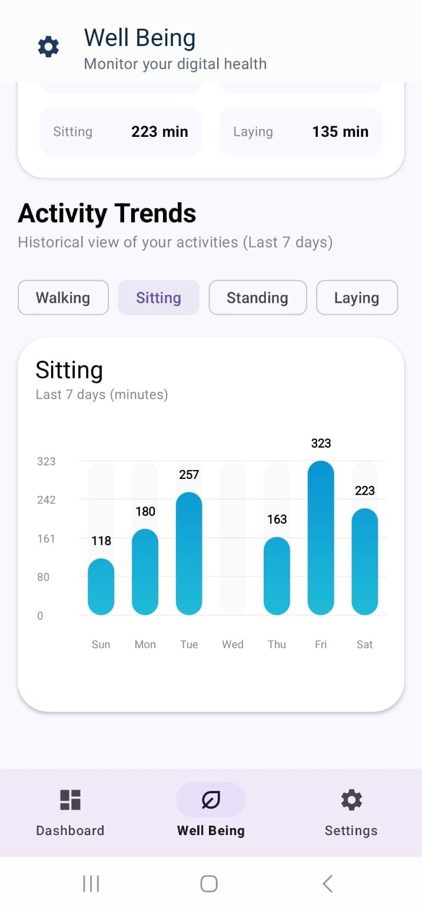
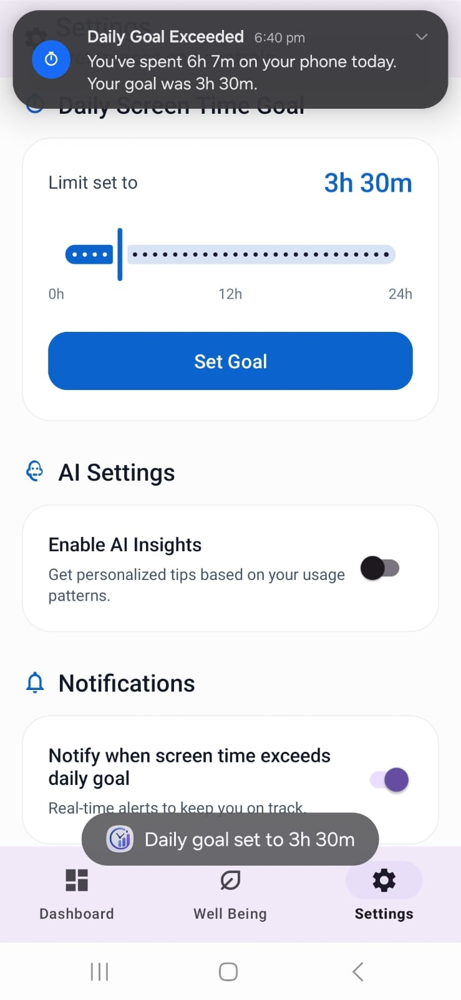

# MyScreenTime

<p align="center"><b>Screen time and physical activity, tracked together, on one dashboard.</b></p>
<p align="center">
  
  
  
  
</p>

An Android app that tracks screen time and physical activity together, and gives suggestions based on both. Most apps handle these separately: a screen time tracker tells you how long you were on your phone, and a fitness app tells you how much you moved. This app connects the two, so a suggestion like "you've been sitting and scrolling for two hours" is possible.
## Screenshots

<table align="center">
  <tr>
    <td align="center" valign="top">
      <kbd></kbd>
    </td>
    <td align="center" valign="top">
      <kbd></kbd>
    </td>
    <td align="center" valign="top">
      <kbd></kbd>
    </td>
  </tr>
  <tr>
    <td align="center" valign="top">
      <kbd></kbd>
    </td>
    <td align="center" valign="top">
      <kbd></kbd>
    </td>
    <td align="center" valign="top">
      <kbd></kbd>
    </td>
  </tr>
</table>

## What it does

- Tracks total daily screen time, most-used app, and last-used app via Android's `UsageStatsManager`
- Classifies physical activity in real time (Walking, Walking Upstairs, Walking Downstairs, Sitting, Standing, Laying) using the phone's accelerometer and gyroscope
- Shows a live activity breakdown and 7-day activity trends on the Well Being screen
- Combines both data sources into a single insight, instead of showing two disconnected numbers
- Configurable daily screen time goal with notifications when exceeded
## Activity recognition model

Physical activity classification runs fully on-device using a GRU (Gated Recurrent Unit) based model, a type of recurrent neural network layer built to handle sequential data. Motion isn't a single instantaneous reading, it's a pattern over time, and the GRU is what lets the model read that pattern instead of judging one instant in isolation.

- **Source:** [vkm007/Human-Activity-Recognition](https://github.com/vkm007/Human-Activity-Recognition) (not trained in-house)
- **Dataset:** UCI HAR (accelerometer and gyroscope readings from a waist-mounted smartphone)
- **Input:** 128 timesteps of 9 features per prediction, accelerometer (x, y, z), gyroscope (x, y, z), and total acceleration (x, y, z)
- **Output:** 6-class softmax (Walking, Walking Upstairs, Walking Downstairs, Sitting, Standing, Laying)
- **Size:** 44 KB, runs on-device via TensorFlow Lite / LiteRT, no server calls
- **Validation:** before integrating it, the model was tested against the real UCI HAR test set independently, measuring 91% accuracy on unseen data rather than relying on the source repository's reported numbers
## Architecture

The app runs two data pipelines that feed into a shared insight layer:

1. **Sensor pipeline:** SensorManager collects accelerometer, gyroscope, and linear acceleration readings, buffers them into a 128-sample sliding window, and runs the window through the on-device GRU model.
2. **Screen time pipeline:** `UsageStatsManager` reads per-app usage, stored locally in a Room database.
   Both outputs are combined into one suggestion (rule-based, with an optional Groq API-based version) and surfaced on the Balance/Well Being screen.

## Tech stack

- **Language:** Kotlin
- **UI:** XML views for Dashboard and Settings; the Well Being screen (where the activity model runs) is built in Jetpack Compose
- **Local storage:** Room
- **ML inference:** TensorFlow Lite / LiteRT
- **Architecture pattern:** MVVM
## Permissions

- `PACKAGE_USAGE_STATS` (Usage Access) to read app usage statistics
- `BODY_SENSORS` / standard sensor access for accelerometer and gyroscope
  No data leaves the device except when the user explicitly enables AI-generated insights (Groq API).

## API key setup

The app uses the Groq API for AI-generated insights. The key is read from `local.properties` at the project root, which is git-ignored and never committed.

1. Get an API key from [Groq](https://console.groq.com/keys).
2. In the project root (same folder as `settings.gradle.kts`), open or create `local.properties`.
3. Add this line:
```
GROQ_API_KEY=your_key_here
```

Gradle exposes this to the app at build time via `BuildConfig.GROQ_API_KEY`. Without this key, the app runs normally but AI-generated insights will not work.

## Setup

- **Android Studio:** latest stable release (required to support AGP 9.2.1)
- **Android Gradle Plugin (AGP):** 9.2.1
- **Gradle:** 9.4.1 (via wrapper, no separate install needed)
- **Kotlin:** 2.2.10
- **JDK:** 17 (required to run AGP 9.x; app bytecode target is Java 11)
- **compileSdk / targetSdk:** 37
- **minSdk:** 24 (Android 7.0+)
```
git clone https://github.com/YashBhadange2006/MyScreenTime.git
```

Open in Android Studio, let Gradle sync, add the API key as described above, then run on a physical device. Sensor-based activity recognition will not produce meaningful data on an emulator, since there is no real accelerometer/gyroscope input to read.

## Credits

Activity recognition model adapted from [vkm007/Human-Activity-Recognition](https://github.com/vkm007/Human-Activity-Recognition), trained on the [UCI HAR dataset](https://archive.ics.uci.edu/dataset/240/human+activity+recognition+using+smartphones).